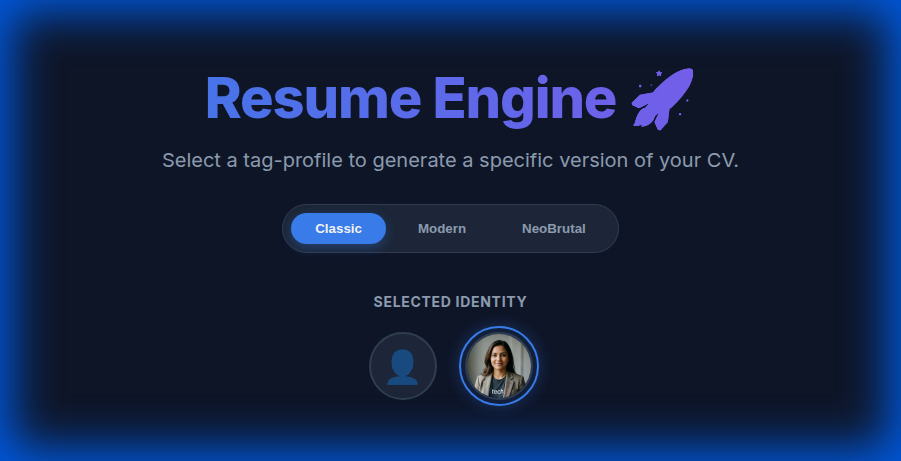
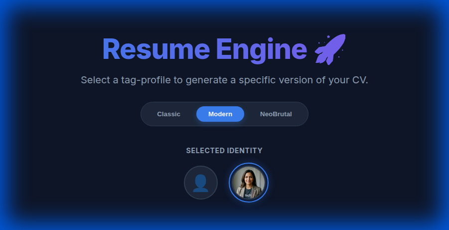
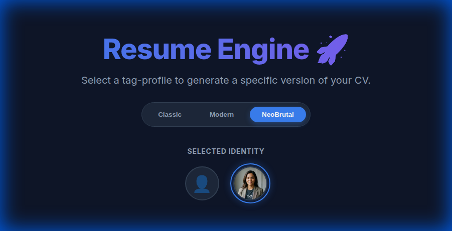
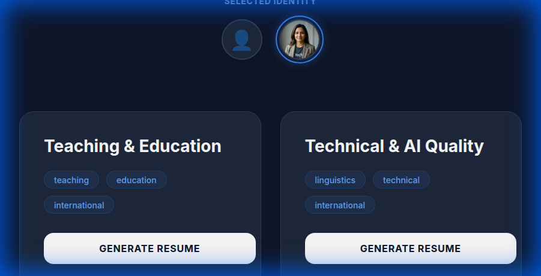
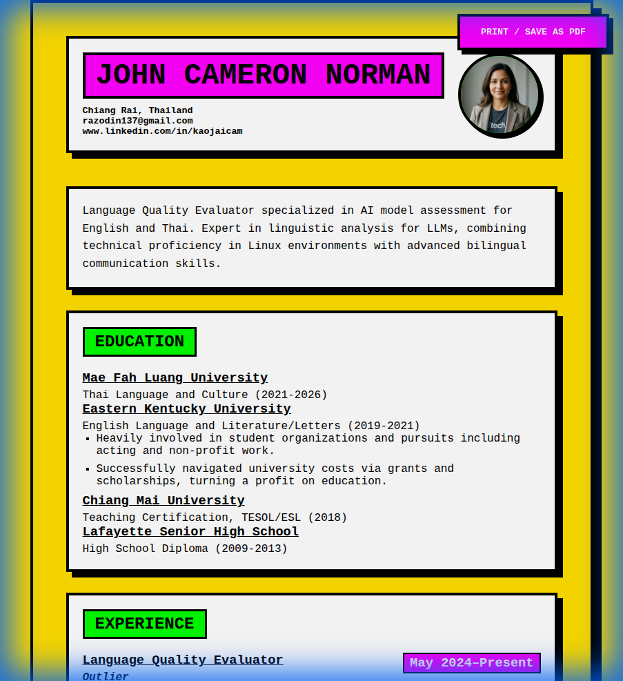

# 🚀 Resume Engine

A powerful, highly-customizable resume generator built with **Astro**. Generate tailored resumes for different roles from a single Master CV data source using advanced tag-based filtering.

## ✨ Features

-   **🎯 Multi-Profile Generation**: Create specific CV versions (Teaching, Technical, Business, etc.) from one `master-cv.json`.
-   **�🇭 Multilingual Support**: Seamlessly switch between English and Thai resume versions, including localized date formats and headers.
-   **�🎨 Dynamic Themes**: Switch between multiple professional styles in real-time.
-   **🖼️ Identity Gallery**: Drag-and-drop profile pictures and select them from a visual gallery.
-   **📄 PDF Ready**: Optimized for "Print to PDF" with letter-size formatting and high-fidelity layouts.
-   **⚡ Built with Astro**: Ultra-fast static site generation.

---

### New Entries, New Experiences.

If you need to add a new entry to the resume, you can use the `TEMPLATES.md` file in `src/data/` as a reference. It's right next to your master-cv.json file that you're going to be using for ALL your data. 

master-cv.json is the master file that contains all your education, experiences, skills, achievements, etc.

---

## 🛠️ Performance & Themes

### 🖥️ The Dashboard
Select your target profile and theme from our premium dark-mode dashboard.



### 🎭 Theme Selection
Toggle between different aesthetics to match the job you're applying for.

| Classic | Modern | NeoBrutal |
| :---: | :---: | :---: |
|  |  |  |

---

## 🖼️ Profile Picture Gallery
Customize your identity. Any image dropped into `public/images/profiles/` automatically appears in the selection gallery.



---

## 📄 Output Styles

### 🏛️ Classic Theme
A traditional, serif-based layout for established industries.


### 💎 Modern Theme
A sleek sidebar layout with emerald accents and professional spacing.


### 🤘 NeoBrutal Theme
A bold, high-contrast design for creative and technical roles. Thick borders, bright colors, and hard shadows.


## 🇹🇭 Thai Language Support

The engine supports full Thai localization. 
-   **Data Source**: Edit `src/data/master-cv-th.json` for Thai content.
-   **Templates**: Use `src/data/TEMPLATES-TH.md` for pre-translated Thai snippets.
-   **Smart Localization**: Automatically handles Buddhist Era (BE) year conversion and Thai month names.
-   **Toggle**: Use the language switcher on the dashboard to update all resume paths to `/th/`.

### 🔄 Translation Workflow
Adding Thai translation will require manual input. However, fields like "tags, company, start and end date" will be shared between the Thai and English versions and be handled automatically by the build.

---

## 🚀 Getting Started

1.  **Install dependencies**:
    ```bash
    npm install
    ```
2.  **Run development server**:
    ```bash
    npm run dev
    ```
3.  **Edit your data**:
    -   Update `src/data/master-cv.json` with your personal info.
    -   **Tip:** Look at the `"TEMPLATES"` block at the top of the JSON file for clean examples you can copy-paste into your experience or education lists.
    -   Define profiles in `src/data/profiles.json`.
4.  **Add images**:
    -   Drop photos in `public/images/profiles/`.
5.  **Build & Print**:
    -   Select your profile/theme, click "Generate Resume", and use `Cmd/Ctrl + P` to save as PDF.

---

## 📂 Project Structure

-   `src/data/`: JSON sources for CV and Profile definitions.
-   `src/pages/`: Astro routes for the dashboard and dynamic resume generation.
-   `src/styles/themes/`: CSS implementations for each theme.
-   `src/utils/`: Logic for filtering and sorting CV items based on tags.
-   `public/images/profiles/`: Your custom profile pictures.
